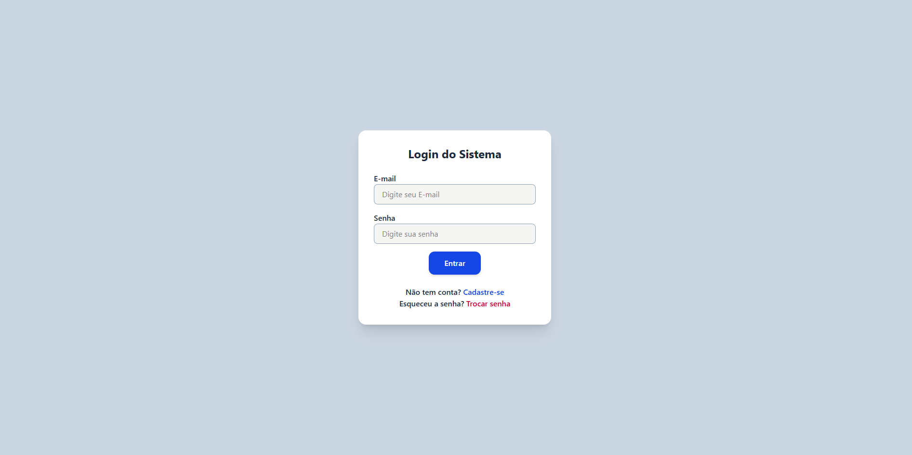
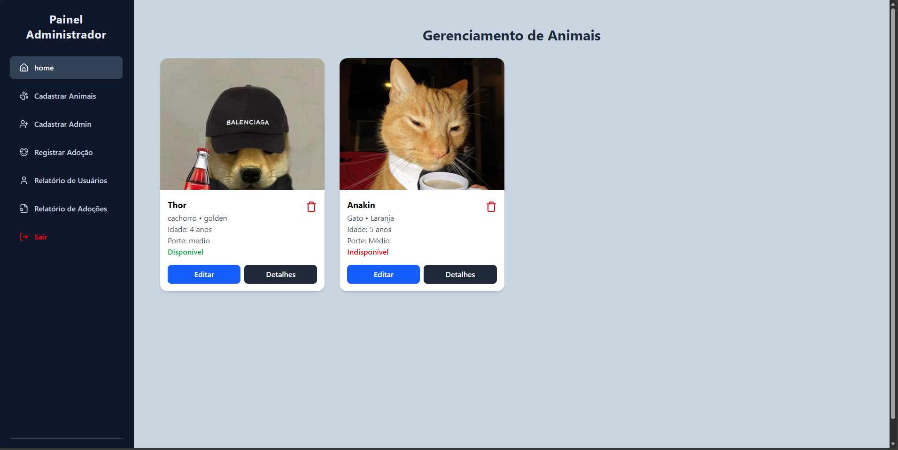
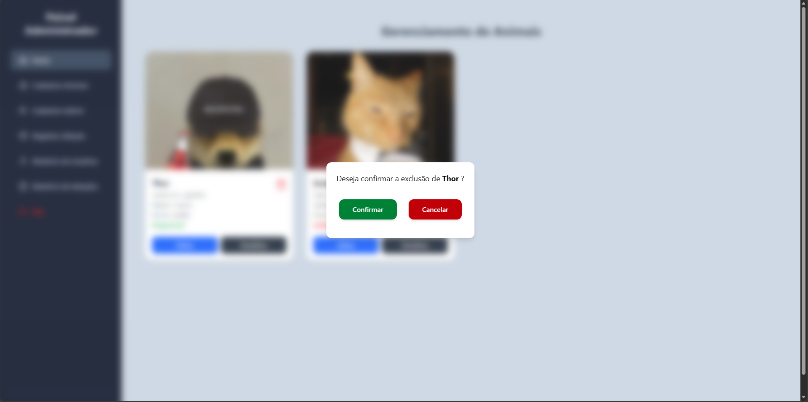
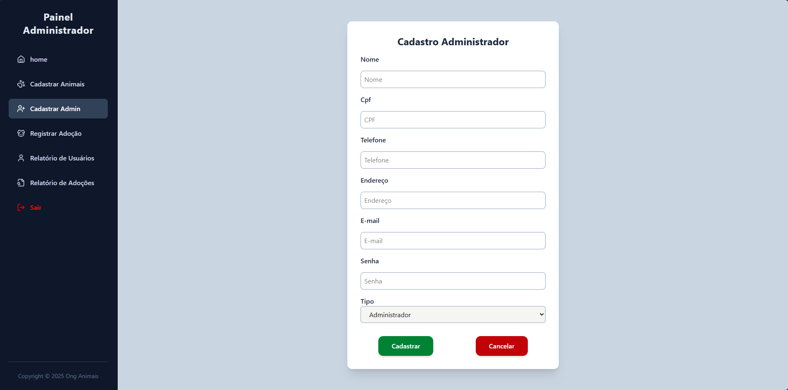

# 🐾 Sistema de Adoção de Animais

Este projeto é uma aplicação web desenvolvida para auxiliar no gerenciamento de animais disponíveis para adoção, controle de adotantes e registro de processos de adoção. É uma solução voltada especialmente para ONGs e instituições que promovem o bem-estar animal.

## 📌 Visão Geral

O sistema é dividido em:

- **Backend:** API REST desenvolvida com **TypeScript**, **Node.js** e **Express**, responsável pelo gerenciamento de dados e regras de negócio.
- **Frontend:** Aplicação **React** construída com **JavaScript**, oferecendo uma interface moderna e intuitiva para administradores e visitantes.

## 👥 Perfis de Usuário

- **Administradores:** Cadastram, atualizam e controlam os dados dos animais e adotantes, além de registrar os processos de adoção e visualizar relatórios.
- **Visitantes:** Acessam a plataforma para visualizar os animais disponíveis para adoção e filtrá-los por espécie, idade ou porte.

---

## ⚙️ Funcionalidades Principais

### 🐶 Gestão de Animais
- Cadastrar, editar e excluir animais
- Listar todos os animais
- Filtrar por porte, espécie e status

### 👤 Gestão de Adotantes
- Cadastrar, editar e excluir adotantes
- Listar todos os adotantes

### 📝 Processo de Adoção
- Realizar adoção (vincular adotante e animal)
- Atualizar status do animal para "Indisponível"
- Registrar a data da adoção
- Acessar histórico de adoções

### 📊 Relatórios
- Animais disponíveis
- Animais adotados
- Histórico de adoções realizadas

---

## 🔁 Fluxo de Funcionamento

### Visitante
1. Fazer o cadastro e Login
2. Acessa a página inicial
3. Visualiza os animais disponíveis
4. Filtra por porte, espécie ou idade

### Administrador
1. Realiza login
2. Gerencia animais e adotantes
3. Registra adoções
4. Visualiza relatórios e histórico

---

## 💻 Tecnologias Utilizadas

### Backend
- [Node.js](https://nodejs.org/)
- [TypeScript](https://www.typescriptlang.org/)
- [Express](https://expressjs.com/)
- [PostgreSQL](https://www.postgresql.org/)

### Frontend
- [React](https://reactjs.org/)
- [Vite ou Create React App](https://vitejs.dev/)
- [CSS3](https://developer.mozilla.org/pt-BR/docs/Web/CSS)

---

## Prévias do sistema em funcionamento
Aqui estão algumas imagens do projeto:

### Tela login

### Tela Animais

### Tela exclusão de animal

### Tela registro de usuários

---
